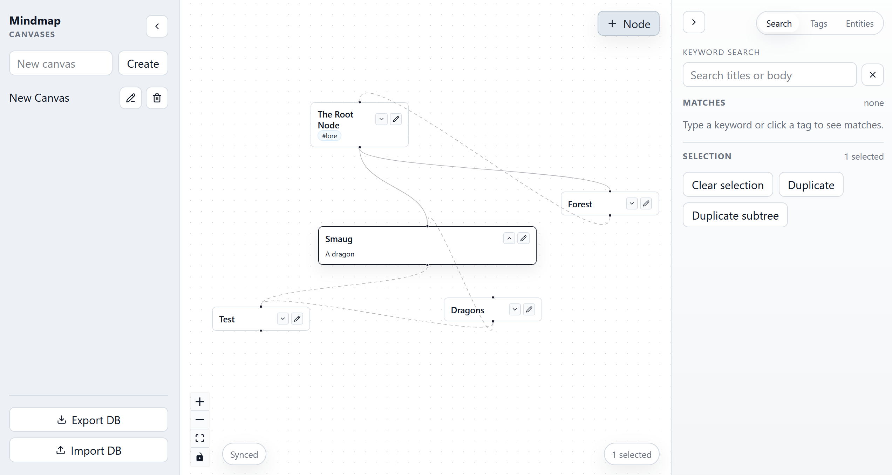

# Mindmap

Mindmap is software that is designed to improve how you take notes. You can create multiple notebooks and link notes together in various ways to represent how different ideas are connected. You can download the latest version of the desktop app for Windows or Ubuntu on the [Releases page](https://github.com/BurntChromium/MindMap/releases).

Mindmap is beta software: it works, but there may be rough edges. Right now, you can:
- Create notebooks
- Connect ideas (either directly, or by mentioning entities in `[[brackets]]`)
- Tag notebooks (like `#this`)
- Search and filter your notes
- Apply basic formatting (**bold**, _italics_, or [hyperlinks](#)) via Markdown syntax.
- Import or export your data as `sqlite` databases.

The application has strong keyboard support (most actions can be taken with just the keyboard - but it's early so things aren't perfect!). 

Mindmap is free and open-source, and has no ads, spyware, telemetry, accounts, subscriptions, or AI features.

### Tech Stack

This app uses Svelte and XYFlow on the front-end, and Tauri and SQLite on the back-end.

See [USER_GUIDE.md](./USER_GUIDE.md) for the app layout and keyboard shortcuts.
See [CHANGELOG.md](./CHANGELOG.md) for release notes.

## Build

This program can be built as either a web app or a desktop app. Releases are only for the desktop app (at least for now).

### Commands

- `npm run dev`: run the web app in the browser
- `npm run tauri dev`: run the desktop app in Tauri for development
- `npm run build`: build the web app for production
- `npm run build:desktop`: build the static frontend used by Tauri
- `npm run tauri build`: bundle the Tauri desktop app for release
- `npm run test:e2e`: run the full Playwright suite against the built app via `vite preview`
- `npm run test:e2e:dev`: run the quick Playwright smoke spec against `npm run dev`
- `npm run test:e2e:headed`: run the Playwright suite in headed mode
The generated desktop build outputs are ignored by git, so you can rebuild locally without polluting the working tree.

Playwright uses a temporary SQLite database for each run, so the E2E suite does not touch `dev.db` or `mindmap.db`.

### Release Workflow

Releases are started manually from your local machine through GitHub Actions.

Before releasing, bump the version in both `package.json` and `src-tauri/tauri.conf.json` to the same value.

Then run:

- `npm run release -- --version <version>`

That command uses the GitHub CLI to dispatch the `Release` workflow with the version you pass in. The workflow then runs `npm run check`, `npm test`, and the Playwright suite in headless mode. If those checks pass, it builds Linux and Windows artifacts and uploads them to a draft GitHub Release.

You can publish the draft release from GitHub after reviewing the assets.

### Desktop Prerequisites

To build the desktop app locally you generally need:

- Node.js and npm for the frontend build and package scripts
- Rust and Cargo for the Tauri backend in `src-tauri`
- Platform-specific native tooling required by Tauri:
  - Windows: Microsoft C++ Build Tools and WebView2
  - macOS: Xcode, or Xcode Command Line Tools for desktop-only builds
  - Linux: WebKitGTK plus the native libraries Tauri requires for your distro

The repo uses bundled SQLite libraries, so you do not need a separate system SQLite install for the normal desktop build path.

### Database Paths

- `npm run dev` uses `dev.db`
- `npm run build` plus `npm run preview` uses `mindmap.db`
- The left panel includes a `Database file` field that renames the live SQLite file and persists the choice in a `mindmap.config.json` file alongside the active database directory
- `MINDMAP_DB_PATH` still overrides either default when set, which is mainly useful for development and tests
